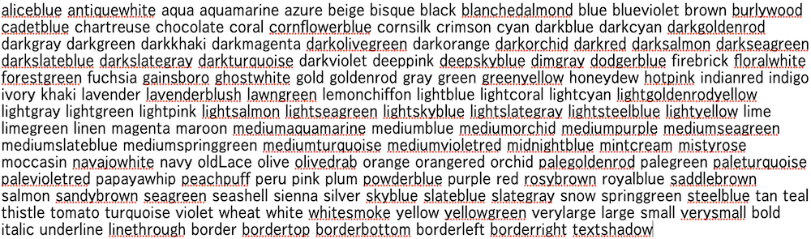
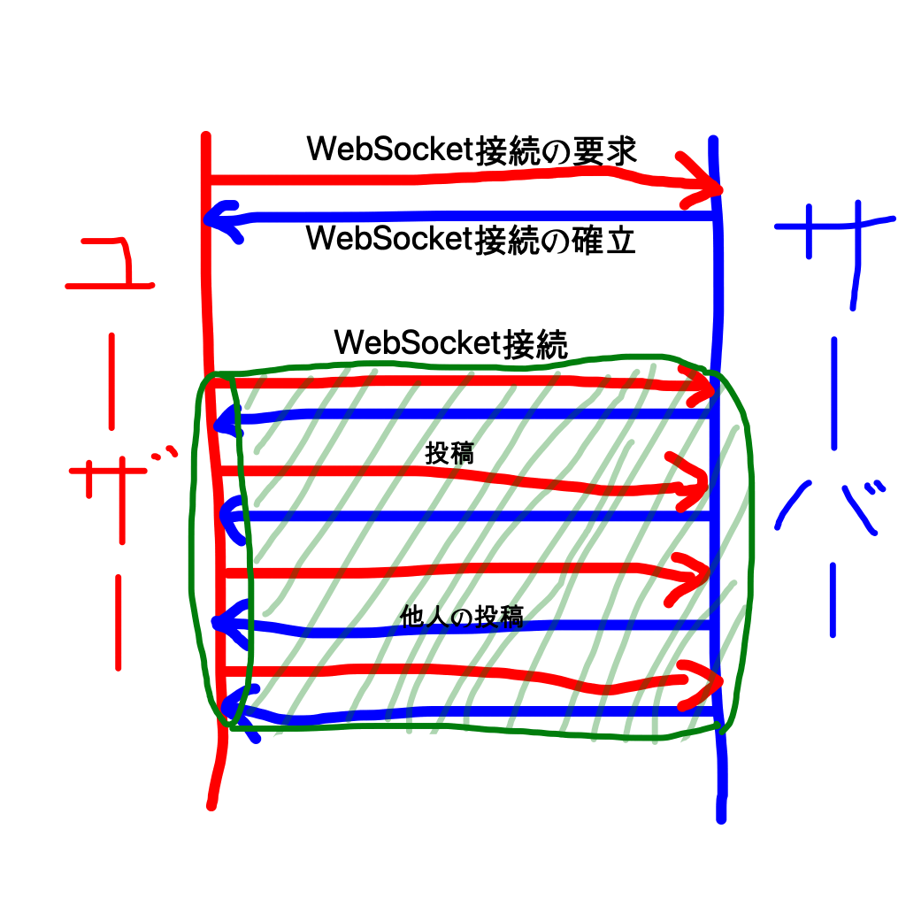

# ２ちゃんの全て

## 前書き
PC部の伊藤です。
川添くんが「VRジェットコースターの全て」なる部誌を書いたのでまあ俺も解説記事書いとくか...というわけで書きます。 
といってもプログラミングできる人なら２ちゃんの構造はすぐにわかるだろうから、そういうのが分からない方が理解できるような記事です。 
念のために申しておくとここでの「２ちゃん」は僕が作った方であって本家の方ではありません。

まだ訪問していない方は[ここ](https://bjcodes.net:1137/wss.html)からどうぞ

## 制作経緯
去年の音展が終わった後、サーバーサイド(サーバー側での処理)も触ってみたいと思いPHPという言語を勉強していたので、それを使って掲示板を作ることにしました。(それ以外何も思いつかなかった) 
~~結局PHPからnode.jsという言語に乗り換えてるけど~~

## 機能
目指したのは書き込みやすい匿名掲示板です。
最初は登録&自動ログイン機能を実装していましたが、多分誰も登録しないだろう...(経験則)と思って廃止しました。 
誰でも登録なしでスレッドを作成でき、自由にコメントできます。 
装飾文字で遊べます。かっこで囲って中にコマンドと内容を書きます。以下例 
(red 赤文字) -> 赤文字 
(large bold 大きな太文字) -> 大きな太文字 
コマンド一覧

管理してる側からは個人が特定できるのでBANやMUTEができます。またスレッドの作成も12時間に１つまでに制限しています。105回生は英Sでネットでの匿名性は主観的だっていうやつ読みましたよね。それです。 

あとは通報ボタンから僕にメールが送れますけど僕は返信できません。(送信者のメールアドレスが特定できないので当たり前) あくまで通報用です。

## 仕組み
LINEみたいに送信したメッセージがリアルタイムで他の人の画面に反映されるようにWebSocketという技術を使っています。これが肝になる部分なので少し解説します。 
Web通信の一般的な通信規格はHTTPと呼ばれるものです。
「 http://www.koyo.ac.jp/ 」 のhttpなので馴染みがあると思います。 
しかしHTTPではユーザーは一回の接続で一つしかリクエストを送れず、サーバーから情報やリクエストを送ることはできません。 
そこでWebSocketが生まれました。WebSocketを使えば一度接続を確立するとサーバーとユーザーのどちらからも通信を始めることができます。会話をしているような感じです。これによってリアルタイムでサーバーとユーザーが投稿を共有できるのです。 

### 投稿する時
①ユーザーが内容を入力します 
②サーバーに内容を送信します 
③

⑨

