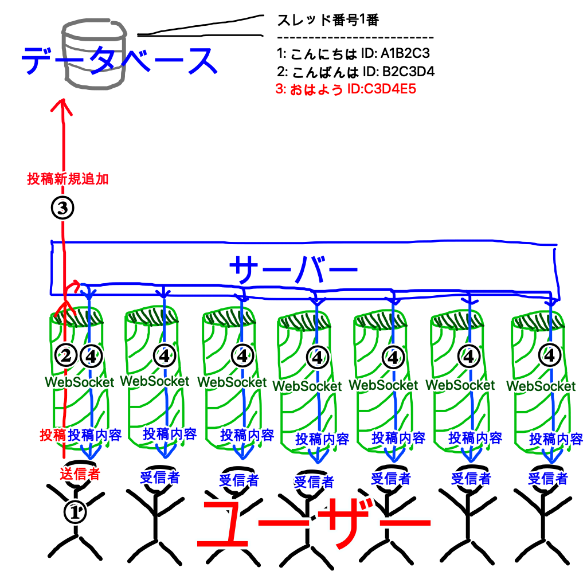

# ２ちゃんの全て

## 前書き
PC部の伊藤です。
川添くんが「VRジェットコースターの全て」なる部誌を書いたのでまあ俺も解説記事書いとくか...というわけで書きます。 
といってもプログラミングできる人なら２ちゃんの構造はすぐにわかるだろうから、そういうのが分からない方向けの記事です。難しい箇所は都合よく省いています。 
念のために言っておくとここでの「２ちゃん」は僕が作った方であって本家の方ではありません。

まだ訪問していない方は[ここ](https://bjcodes.net:1137/wss.html)からどうぞ

## 制作経緯
去年の音展が終わった頃、サーバーサイド(サーバー側での処理)も触ってみたいと思いPHPという言語を勉強していたので、それを使って掲示板を作ることにしました。(それ以外何も思いつかなかった) 
~~結局PHPからnode.jsという言語に乗り換えてるけど~~ 
7/30に完成しました。

## 機能
目指したのは書き込みやすい匿名掲示板です。 
先輩後輩とか先生生徒とか相手の素性を気にせず意思疎通できたら面白いんじゃないかということです。最近そういう場がなかなかないので... 
最初は登録&自動ログイン機能を実装していましたが、多分誰も登録しないだろう(経験則)と思って廃止しました。そもそも上記の目的のためにもユーザー名で個性を発揮してくれると困るわけです。全員区別ができない状態でなくてはならない。 
誰でも登録なしでスレッドを作成でき、自由にコメントできます。 
\>\>1 などと書くことで発言相手を明記できます(アンカー)。クリックで返信先のコメントが表示されます。 
URLは識別してリンクになります。 
装飾文字で遊べます。かっこで囲って中にコマンドと内容を書きます。以下例 
(red 赤文字) -> 赤文字 
(large bold 大きな太文字) -> 大きな太文字 
コマンド一覧

管理してる側からは個人が特定できるのでBANやMUTEができます。105回生は英Sでネットでの匿名性は主観的だっていうやつ読みましたよね。それです。 
またスレッドの作成も12時間に1つまでに制限しています。あまりに多いと訳わからんくなるので。 
スレッドはコメント数と最新コメントの日付から人気がある順で並び替えています。 
IDは日付が変わると更新されます 

あとは通報ボタンから僕にメールが送れますけど僕は返信できません。(送信者のメールアドレスが特定できないので当たり前) あくまで通報用です。

## 仕組み
LINEみたいに送信したメッセージがリアルタイムで他の人の画面に反映されるようにWebSocketという技術を使っています。これが肝になる部分なので少し解説します。 
Web通信の一般的な通信規格はHTTPと呼ばれるものです。
「 http://www.koyo.ac.jp/ 」 のhttpなので馴染みがあると思います。 
しかしHTTPではユーザーは一回の接続で一つしかリクエストを送れず、サーバーから情報やリクエストを送ることはできません。 
そこでWebSocketが生まれました。WebSocketを使えば一度接続を確立するとサーバーとユーザーのどちらからも通信を始めることができます。会話をしているような感じです。これによってリアルタイムでサーバーとユーザーが投稿を共有できるのです。 

### 投稿する時
①ユーザーが内容を入力 
②サーバーに内容を送信 
③データベースに投稿内容を記録 
④接続しているユーザー全員に投稿を送信 

スレッドを立てるときも同様で「投稿」の部分がスレッドの名前に変わるだけで、サーバーからデータベースには新しいスレッドを作る命令をします。

データベースは内容を記録しているノートみたいなものだと考えるといいと思います。スレッドの名前やユーザー情報やスレッド内の投稿など、書くものによってページが分けられていて、適切なページにデータを書き込むような感じです。

## 後書き
大体仕組みがわかったと思います。最後までありがとうございました。[掲示板(リンク)](https://bjcodes.net:1137/wss.html)

