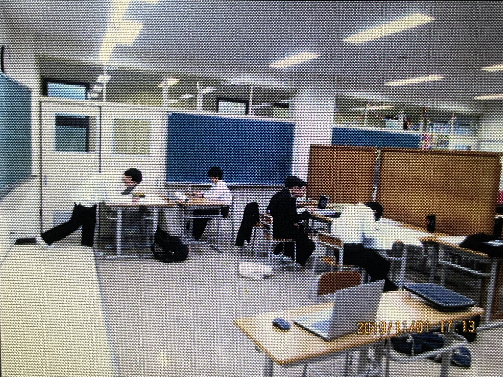

# PC部の歴史

>われわれは、三つの問題を立てることにしたい。  
>一&nbsp;&nbsp;PC部とは何か？ ──全てである。 
>二&nbsp;&nbsp;PC部は、これまで、甲陽においてどのようなものであったか。──無であった。 
>三&nbsp;&nbsp;PC部は何を要求しているのか。──何がしかのものになることを。

PC部の歴史を編纂したいと思ってましたが去年はなんだかんだで部誌が出せずできなかったので、今年こそはと思ってまとめました

形式 
・西暦 
・105回生(今の高2生)の学年 
・説明

注: 正確には「PC同好会」ですがここでは「PC部」と表記します

## 2019年

##### 105回生 中1三学期〜中2二学期

1月 
現部長のK君がバスケ部をやめ、PC部を設立しました。
初期メンバーは五人で全員中一生でした。

5月 
甲陽には自由の学びの奨学金という制度があって、自主的な活動にお金が欲しい!となった時に審査に通れば奨学金がもらえます。PC部はパソコン一台を申請し、ありがたいことに奨学金で買っていただきました。 
~~結構スペックのいい物を無理して買っていただいた~~
このパソコンはパソコンを学校に持って来られない部員が使ったり音展の展示用のパソコンとして使わせていただきました。

6月 
少し部員が増えて7人になりました。(なお全員105回生) 
前述のパソコンが届きました。

7月 
このころ105回生は中2となり、地理の授業でケッペンの気候区分を習っていたので、気候区分を判定するプログラムを書いてパソコンに判定させるのが流行りました。

※参考 
| 熱帯A | 乾燥帯B | 温帯C | 亜寒帯D | 寒帯E |
|-------|---------|-------|---------|-------|
| Af 熱帯雨林気候| BS ステップ気候 | Cw 温暖冬季少雨気候 | Df 亜寒帯湿潤気候 | ET ツンドラ気候 |
| Am 弱い乾季のある熱帯雨林気候 | BW 砂漠気候 | Cs 地中海性気候 | Dw 亜寒帯冬季少雨気候 | EF 氷雪気候 |
| Aw サバナ気候 | | Cs 地中海性気候 | | |
| | | Cfa 温暖湿潤気候 | | |
| | | Cfb 西岸海洋性気候 | | |

先に30を行った方が勝ちになるゲームをいろいろな言語で作ったりしました。 
五目並べ、オセロ、マイクラのmod、ホームページなども作りました。

11月 
初めての音展となりました。
教室の半分を借り、プログラミング言語についてのポスター数枚、ホームページ、オセロ(コンピューターと対戦)を展示しました。ホームページでは他の団体の展示の紹介や準備中の写真などを掲載しました。

写真: PC部準備中の様子 
手前のパソコンでホームページ、オセロの展示をし、右側の仕切り板でポスターを展示しました。

オセロに関してはオセロ全国大会一位の子とそのお父様が来られて、ボコボコにされました。 
また、106回生が数名入部して部員は10人になりました。

12月
パソコンを自作する部員が出てきたり、競技プログラミング(以下競プロ)を始める部員が出てきました。

## 2020年

##### 105回生 中2三学期〜中3二学期

## 2021年

##### 105回生 中3三学期〜高1二学期

## 2022年

##### 105回生 高1三学期〜高2二学期