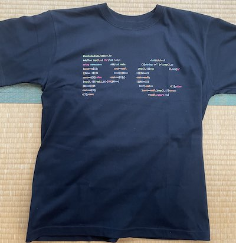

# PC部の歴史

>われわれは、三つの問題を立てることにしたい。  
>一&nbsp;&nbsp;PC部とは何か？ ──全てである。 
>二&nbsp;&nbsp;PC部は、これまで、甲陽においてどのようなものであったか。──無であった。 
>三&nbsp;&nbsp;PC部は何を要求しているのか。──何がしかのものになることを。

PC部の歴史を編纂したいと思っていたが去年はなんだかんだで部誌が出せずできなかったので、今年こそはと思ってまとめた。

形式 
・西暦 
・105回生(今の高2生)の学年 
・説明

注: 正確には「PC同好会」だがここでは「PC部」と表記する。
## 2019年

##### 105回生 中1三学期〜中2二学期

1月 
現部長のK君がバスケ部をやめ、PC部を設立した。
初期メンバーは五人で全員が中1だった。

5月 
甲陽には自由の学びの奨学金という制度があり、自主的な活動にお金が欲しくなった時に審査に通れば奨学金がもらえる。PC部はパソコン一台を申請し、ありがたいことに奨学金で買っていただいた。 
~~結構スペックのいい物を無理して買っていただいた~~ 
これはパソコンを学校に持って来られない部員が使ったり音展の展示用のパソコンとして使った。

6月 
少し部員が増えて7人になった。(なお全員105回生) 
先述のパソコンが届いた。

7月 
このころ105回生は中2となり、地理の授業でケッペンの気候区分を習っていたので、気候区分を判定するプログラムを書いてパソコンに判定させるのが流行った。 
先に30を行った方が勝ちになるゲームをいろいろな言語で作った。 
五目並べ、オセロ、マイクラのmod、ホームページなども作った。 

11月 
初めての音展となった。

写真: 2019年の音展パンフレット 
2019年のテーマは「船出」で、中学では珍しい二文字だった。 
&nbsp;このパンフレットは逆から読むと「船出」が「甲陽」になるというすごいデザインとなっている。 
<table>
    <tr>
        <td></td>
        <td></td>
    </tr>
</table>

教室の半分を借り、プログラミング言語についてのポスター数枚、ホームページ、オセロ(コンピューターと対戦)を展示した。 
ホームページでは他の団体の展示の紹介や準備中の写真などを掲載した。

写真: PC部準備中の様子 
手前のパソコンでホームページ、オセロの展示をし、右側の仕切り板でポスターを展示した。

オセロに関してはオセロ全国大会一位の子とそのお父様が来られて、ボコボコにされた。 

写真: 配布した部誌 

また、106回生が数名入部して部員は10人になった。 
音展後にある部員はボールを転がして迷路のゴールを目指すというゲームを作った。

12月 
パソコンを自作する部員が出てきたり、競技プログラミング(以下競プロ)を始める部員が出てきた。

## 2020年

##### 105回生 中2三学期〜中3二学期

1月 
国語で漢文の返り点を学んだので、ある部員が返り点から読み順を出力するプログラムを書いた。

2月 
学年末考査があるとおもいきや... 
**新型コロナウイルスの拡大で学校が休みになった** 
休みが続きゲームにも飽き出したので競プロに勤しむ部員が増え、競プロブームが起こった。 
学校が再開して忙しくなる7月まで続いた。

5月 
この頃部員が[GitHub](https://github.com/)という、ファイルの変更履歴を保存できるサービスの勉強を始めた。 
オンライン授業で三角関数を習った。

7月 
中学校はスマホの持ち込みが禁止されている。もちろんパソコンも駄目なのでこの頃までは登校した時に先生にパソコンを預かっていただいていたが、ある日PC部専用ロッカーを買っていただくことになり、それが届いた。 
また、PC部のロゴのデザインはこのロッカーの鍵や物理講義室の鍵が付けてあったオブジェのようなものが元になっている。

8月 
この頃からある部員が音展のために、中学校を360度カメラで撮影し、中学のストリートビューを作り始めた。three.jsというものを使った。

10月 
ある部員がSVGという画像形式からPNGという画像形式に変換するプログラムを書いた。 
ストリートビュー作成のため長い廊下を通行止めにし(顔が写るのが許されていなかったため)、校内のあちこちを撮った。

11月 
2回目の音展を迎えた。
写真: 2020年の音展パンフレット 
2020年のテーマは「道」だった。 
写真の絵はPC部員のH君が描いた。 

この音展では展示スペースを設けず、学校のサーバーを借りてオンラインで発表した。 
ホームページやストリートビューを校内のQRコードからアクセスして見ていただいた。

音展後にはマリオの1-1を自作したりUnityという開発環境でリズムゲームを作る部員が出た。
## 2021年
##### 105回生 中3三学期〜高1二学期

2月 
先述のマリオが完成した。 
この頃PC部の部員数が最も多く、12名いた。

3月 
105回生は全員高校へ進学となり、中学のPC部は実質消滅した。 
PC部のロッカーはおそらくどこかの団体に渡されたと思う。 
高校ではスマホやパソコンの持ち込みは許可される。

4月 
高校でPC部が再び設立された。 
部員は9人となった。 
このタイミングで複数の部員はパソコンを買い替えた。

6月 
ある部員はVue.jsというものの学習を始めた。 
ある部員は高校版のストリートビューを作り始めた。

7月 
ある部員はカメラを[Raspberry Pi](https://www.raspberrypi.com/)というスマホサイズのコンピューターで制御することで定点撮影をし、 
タイムラプスを作った。 
写真: その部員が使ったRaspberry Pi 

[全国中学高校Webコンテスト](https://webcon.japias.jp/index.html)(以下webコン)に参加登録をした。都市鉱山について調べることにした。

8月 
ある部員は高校を3Dモデルで再現した。

9月 
高校の音展は通常9月だが、この年は延期となって11月開催となった。

10月 
数学でベクトルを習った 
ある部員はベクトルを使ってお絵描きができるプログラムを書いた。 
また[ウェブデザイン技能検定](https://www.webdesign.gr.jp/)(3級)に合格した部員もいた。 
webコンのためにある部員はMarkdownという言語をホームページなどで使われる 
HTMLという言語に変換するプログラムを書いた。

11月 
音展のホームページやwebコンのための作品作りをした。 
webコンに関しては最初の審査まで時間がなかったため、11月19日に行われた校外学習の摩耶山ハイキングでパソコンを持参し、山頂で調整をした。 
&nbsp;本来このハイキングは105回生が中一の時に行われるはずだったが、三年連続で雨で中止となり高一ですることになった。 
写真 右: 山頂にある掬星台 左:山頂からの眺め
<table>
    <tr>
        <td></td>
        <td></td>
    </tr>
</table>

3度目の音展を迎えた。 
写真: 2021年の音展パンフレット 
2021年のテーマは「男祭り音the moun展」だった。 

音展のホームページや高校のストリートビューを公開した。 
音展の頃は学校で風邪が流行っており、PC部の半分はしんどかった。

12月 
PC部員3名はポートアイランドの理化学研究所にある[富嶽](https://www.fujitsu.com/jp/about/businesspolicy/tech/fugaku/)を使ってプログラミングができる会に参加した。 
~~とは言っても使うのは富嶽のごく一部だが~~ 
冊子の小問の誘導に沿ってプログラムを組んでいくことで素数ゼミ[(wiki)](https://ja.wikipedia.org/wiki/%E5%91%A8%E6%9C%9F%E3%82%BC%E3%83%9F)の謎を解こうという 
形式だった。そこそこ大変だった。 
富嶽を使えば並列して多くのの処理を同時に行えるので普通のパソコンでは到底終わらない計算量でも数十秒でできた。 
当日は正月前で、多くの研究者が休暇中に計算してもらえるよう富嶽の予約を入れていたので
なかなか順番が回ってこなかった。 
また、NHKの取材が入り、部員の一人のインタビューが放送された。 

写真 右:理化学研究所入口 左: 計算結果を表にしたもの 
<table>
    <tr>
        <td></td>
        <td></td>
    </tr>
</table>

また、ある部員は[ウェブデザイン技能検定](https://www.webdesign.gr.jp/)(2級)に合格した

## 2022年
##### 105回生 高1三学期〜高2二学期

1月 
ある部員はPHPの勉強を始めた 
PC部はwebコンの審査を次々と通過していった。 
最後の審査に向けて、ページの英訳やその他最終調整をした。 

2月 
ある部員はRaspberry Pi(先述)が家にあるのを思い出し、発掘して使い出した。 
写真: そのRaspberry Pi(小学生の時に買ったもの) 

音展のために買い替えようと思ったが半導体不足で新しいものが販売されておらず買えなかった。 

3月 
webコンで金賞をとった。 
作品 [右ポケットの中の資源を求めて](https://contest.japias.jp/tqj24/240166C/) 
校長先生に直接表彰していただいた。 
ある部員はボディトラッカーを自作しようとした。また、Gaia EDR3という星のデータを使って星空の画像を作った。

4月 
ある部員はPHPを使って掲示板を作った。また通信方式やWebSocketという技術の勉強をした。 
ある部員はMIDI形式の音楽ファイルを再生するプログラムを書いた。(キーボードが表示される凝ったもの)

5月 
ある部員はMikuMikuDanceを使って3Dモデルを動かした。 
ある部員はnode.jsとWebSocketの技術を使って掲示板を作ろうと思った。 
ある部員はNeovimというものの学習を始めた。

6月 
105回生は修学旅行で北海道に行った。広かった。 
写真 右:北海道の写真 左: さっぽろテレビ塔 
<table>
    <tr>
        <td></td>
        <td></td>
    </tr>
</table>

7月 
夏休みに入り、ある部員は掲示板を完成させた。 
写真: 掲示板のイメージ画像 

8月 
部員が一名増えた。 
[プログラミング甲子園](https://pckoshien.u-aizu.ac.jp/mobile/)のモバイル部門に出場することになった。ある程度の基礎は完成させた。 
ある部員はVRジェットコースターの制作を始めた。VRゴーグルで流す映像を作った。 
写真: 映像からの切り抜き 

PC部公式Tシャツを作った。
写真 右:シャツの前面 左: シャツの後面 
<table>
    <tr>
        <td></td>
        <td></td>
    </tr>
</table>
全面の「PC」は実行できるコードでできている。 
写真: 出力の文字列(PC部のロゴ) 

多くの部員が旅行に行った。

9月 
音展の準備を進めた。
ある部員はVRジェットコースターの椅子を動かす回路を作った。 
写真: 制作の様子 

ある部員は仕事がなくなったので二人で対戦できる早押しゲームを作った 
写真: ゲームの画面 

また、画像をボトルキャップで表現した時の完成イメージを出力するプログラムを書いた 
写真: 出力例 

ある部員は音展の公式ホームページを作った 
写真: ホーム画面 

