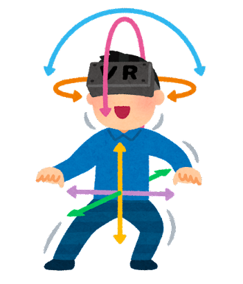

# VRジェットコースター製作の裏話

## 開発開始

VRといっても大きく分けて2種類あります。
専用のホルダーにスマホをはめて使うものと、VRゴーグルを使うものです。
それぞれ基本的には「3DoF」「6DoF」と呼ばれるトラッキングを採用していて、6DoFは3DoFに加えて縦横への移動にも反応してくれます。




ジェットコースターではレールの下を覗きこむなどの動作もしたいので、今回は6DoFを使うことにしました。
専用のVRゴーグルというのはいろいろな種類があるのですが、「追加で高性能なPCが要らない」「そこまで高くない」という条件から、Meta Quest 2を使うことにしました。
これはVRの入門機のような扱いをされているもので、一番売れているゴーグルです。
なによりコスパがいいです。
あと、中身がAndroidベースなのでアプリを作りやすいです。
これは後で役立ちます。

## 3Dモデル作成

走らせるコースを作る必要があります。
去年、PC同好会で「甲陽ストリートビュー」という作品を作ったのですが、そのプロジェクトの一環として校舎のモデルを作っていたので、これをベースにします。
3Dモデルの作成はBlenderで行います。
無料なのにプロ向けの機能が使えるすごいやつです。
VRChatなどのアバター制作によく使われていますね。

校舎のモデルがあるので、あと作らなければいけないのはレールと車体です。
車体は立方体を窪ませてなんとかするとして、レールは平行な棒を2本用意する必要があります。
これを手作業でやろうとすると大変なので、Blenderのモディファイアやカーブ、コンストレイントなどを駆使して楽をします。
今回、レールはレーザーのようなイメージにしたいので、薄い長方形のような断面にします。
実は、レールのために作らなければいけないモデルはこれだけです。

原点と少しずれた場所にあるのがポイントです。
次に、レールを配置したい形にカーブを引きます。

最後に、レールのオブジェクトに対してミラー、配列、カーブのモディファイアを設定します。

ミラーでレールを左右に配置、配列で直線状に伸ばして、カーブでカーブにそって曲げるといったかんじです。
レールが変に捻じれると思うので、カーブの各頂点の「傾き」プロパティをいじって調整してください。

## レール上を滑らせる

最終的にVRゴーグルに移す際にはUnityというアプリを使うので、Unity内蔵の物理エンジンを使えば良いと思っていたのですが、実際にやってみるとガタガタしてうまく使えませんでした。
そこで、Blender上でアニメーションを作り、Unityにインポートするという方法をとることにしました。
Blenderにはさっき作ったレールのカーブがあるので、これに沿って車体を移動させることで、滑らかに滑らせることができます。
車体のモデルに対してパスに追従のコンストレイントを設定することで、カーブに沿って動くようになります。

ただし、物理演算に基づいた動きをするわけではないので、手動でそれっぽく見せる必要があります。

次はUnityにインポートです。
と言っても最近のUnityは.blendファイルの読み込みに対応しているようなので、Unity上でファイルを選択し、プロパティのRigのアニメーションタイプをジェネリックに、Animationのインポートをいい感じにチェックつけたらアニメーションがインポートされます。

シーンにPrefabとして配置したら、Animatorコンポーネントを追加、そして適当にアニメーションコントローラを作って当ててください。
中に入れるアニメーション自体は.blendファイルの中に含まれている感じになっていると思うので、頑張って探しましょう。僕の場合一番最後にありました。

最後に、Unityのカメラを追従させましょう。
これは簡単で、シーン中のカートのモデルをなんとかして見つけ出し、それの子としてカメラを作るだけです。

できたら再生してみましょう。
ジェットコースターっぽくなりました。

## VR化

さあこのままではタイトル詐欺です。「VR」ジェットコースターと言っているからにはVRで動くようにしましょう。
今回はMeta Quest2のスタンドアローンでの動作を想定しているので、Android向けにビルドします。
Android向けのビルド環境ができていない人は、Unity Hubを開いて、使っているUnityにAndroid系のモジュールを加えてください。
そしてQuest2を準備しましょう。
ちなみにQuest2を買おうとしてた時に突如2万円値上げしてめっちゃ困りました。
他の予算を削ってなんとかなりましたが。
そんなことはいいとして、Quest2を開発者モードにします。
Quest2のセットアップに使ったスマホを使い、Oculusアプリの設定→その他の設定から開発者モードをONにできます。
その後パソコンとケーブルで繋ぐと、Quest2の画面に「許可しますか?」的な質問が表示されるので「はい」を押して許可してください。
これで、Quest2をパソコンから触れるようになりました。

では、Unityのビルド設定をします。
プラットフォームをAndroidに切り替え、プレイヤー設定を開き「企業名」「プロダクト名」「バージョン」を設定です。
ここまでは普通のAndroidアプリと同じですね。
ただ追加で、色空間をリニアに、テクスチャ圧縮をASTCにする必要があります。

ここからVR対応にしていきます。
まずはプロジェクト設定の中のXR Plugin Managementをインストールします。
インストールが終わったらプラグインプロバイダーをOculusにしてください。

この状態で実行してみたところ、Quest2に映りはするけれども顔の角度が考慮されていないような挙動をしたので、VR用にカメラの設定をします。
Asset Storeから「Oculus Integration」をインストールします。
結構時間かかります。
終わったら、Assets/Oculus/VR/PrefabsにあるOVRCameraRigを、今カメラを入れている場所に配置します。
カートの子になりますね。
これで実行するとちゃんとしたVRになります。

## 天球を作りたい

Unityに最初から搭載されている空はちょっと安っぽいのでここから変えていきましょう。


絵を描く才能などはないので、できるだけ現実をパクります。
ただ空を作るとなると面倒だな...と思っていたのですが、そういえばいいのがありました。数ヶ月前に作って放置されていた16Kの星空全天球画像です。
詳しくは僕の書いた「めちゃくちゃリアルな星空を作った話」がこの部誌のどこかにあると思うのでそれを見てください。

あの画像は天球の緯度、経度を縦横にとったような構造をしていて3Dとは相性がいいです。
まずはこれを貼る球を作りましょう。

### 球の作成

球なんて元からあるじゃないかと思われるかもしれませんが、この場合普通の球は使えません。
Blenderで「UV球」として使えるような普通の球は、北極や南極にあたる位置の点がつながっているため、極の隣の面が三角形になっています。
このためUV展開(テクスチャのどこを3Dモデルのどこに割り当てるかの設定)したときに使わない領域ができてしまいます。


これを修正した球が必要です。
とはいっても作るのは簡単です。
Blenderを起動し球を生成、両端の頂点を削除、穴の周囲をEキーで伸ばして、Sキーで0倍に拡大、あとはサイドバーで頂点(たち)の座標を(0,0,±1)にすれば構造は終わり。
追加した頂点の分のUVを下のように設定すれば完成です。
ついでにメッシュ数も増やしておきました。


### シェーダー

Unity上にこれを置いてテクスチャを貼ると、「外から見た時に星空が見える球」ができるようになります。
これは困るので、`Sky.shader`という(名前は任意)ファイルを作り、中に次のようなシェーダーを書きます。

```glsl
Shader "Unlit/Sky"
{
    Properties
    {
        _MainTex ("Texture", 2D) = "white" {}
    }
    SubShader
    {
        Tags { "RenderType"="Opaque" }
        Cull Front // add
        LOD 100
        Pass
        {
            CGPROGRAM
            #pragma vertex vert
            #pragma fragment frag
            #pragma multi_compile_fog
            #include "UnityCG.cginc"
            struct appdata
            {
                float4 vertex : POSITION;
                float2 uv : TEXCOORD0;
            };
            struct v2f
            {
                float2 uv : TEXCOORD0;
                UNITY_FOG_COORDS(1)
                float4 vertex : SV_POSITION;
            };
            sampler2D _MainTex;
            float4 _MainTex_ST;
            v2f vert (appdata v)
            {
                v.uv.x = 1-v.uv.x;
                v2f o;
                o.vertex = UnityObjectToClipPos(v.vertex);
                o.uv = TRANSFORM_TEX(v.uv, _MainTex);
                UNITY_TRANSFER_FOG(o,o.vertex);
                return o;
            }
            fixed4 frag (v2f i) : SV_Target
            {
                fixed4 col = tex2D(_MainTex, i.uv);
                UNITY_APPLY_FOG(i.fogCoord, col);
                return col;
            }
            ENDCG
        }
    }
}
```

これで内側から見ることができるようになりました。

しかし、実際の星空とよく見比べてみると、向きがおかしいです。
実際は、日本から見ると天球は斜めになって回転しています。

まず初めに考えつく方法は、球を斜めに配置するというものです。
これが結構優秀で、後で回転させる時にも楽なのですが、今回は途中で「昼の空のテクスチャは回転しないから夜の部分だけ回転させたい」とよくわからないことを考えたので全部シェーダーで書きます。
これに回転機能などをつけた完成品が以下です。

```glsl
Shader "Unlit/Sky"
{
    Properties
    {
        _MainTex ("DayShader", 2D) = "blue" {}
        _NightTex ("StarShader", 2D) = "white" {}
        _Blend("Blend",Range (0, 1)) = 1
        _Round("Round",Range (0, 1)) = 0
    }
    SubShader
    {
        Tags
        {
            "RenderType"="Opaque"
        }
        Cull Front
        LOD 100
        Pass
        {
            CGPROGRAM
            #pragma vertex vert
            #pragma fragment frag
            #pragma multi_compile_fog
            #include "UnityCG.cginc"
            struct appdata
            {
                float4 vertex : POSITION;
                float2 uv : TEXCOORD0;
            };
            struct v2f
            {
                float2 uv : TEXCOORD0;
                UNITY_FOG_COORDS(1)
                float4 vertex : SV_POSITION;
                float3 viewDir : TEXCOORD1;
            };
            sampler2D _MainTex;
            sampler2D _NightTex;
            float _Blend;
            float4 _MainTex_ST;
            float _Round;
            v2f vert(appdata v)
            {
                v.uv.x = 1 - v.uv.x; // add
                v2f o;
                o.vertex = UnityObjectToClipPos(v.vertex);
                o.uv = TRANSFORM_TEX(v.uv, _MainTex);
                o.viewDir = -normalize(_WorldSpaceCameraPos - mul(unity_ObjectToWorld, v.vertex));
                UNITY_TRANSFER_FOG(o, o.vertex);
                return o;
            }
            float4 quaternion(float rad, float3 axis)
            {
                return float4(normalize(axis) * sin(rad * 0.5), cos(rad * 0.5));
            }
            float3 rotateQuaternion(float rad, float3 axis, float3 pos)
            {
                float4 q = quaternion(rad, axis);
                return (q.w * q.w - dot(q.xyz, q.xyz)) * pos + 2.0 * q.xyz * dot(q.xyz, pos) + 2 * q.w * cross(
                    q.xyz, pos);
            }
            fixed4 frag(v2f i) : SV_Target
            {
                const float PI = 3.14159;
                const float LATITUDE = 34.76; // Koyo
                fixed4 day = tex2D(_MainTex, i.uv);
                float3 rotated = rotateQuaternion((90 - LATITUDE) / 180 * PI, float3(1, 0, 0), i.viewDir);
                float2 starUV = float2((atan2(rotated.x, rotated.z) + PI) / (2 * PI),
                                       -atan2(sqrt(pow(rotated.x, 2) + pow(rotated.z, 2)), rotated.y) / PI + 1);
                starUV.x -= _Round;
                fixed4 night = tex2D(_NightTex, starUV);
                fixed4 col = day * (1 - _Blend) + night * _Blend;
                UNITY_APPLY_FOG(i.fogCoord, col);
                return col;
            }
            ENDCG
        }
    }
}
```

うーん、長いし読みにくい。
視線ベクトルをクォータニオンで回転させているのがポイントです。

// ログにとっておいた動画を参考にしながら書く
