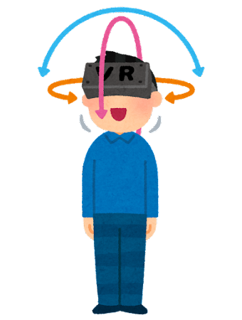
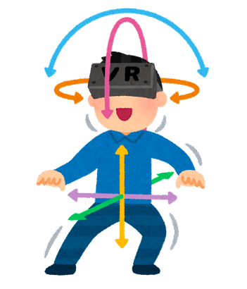
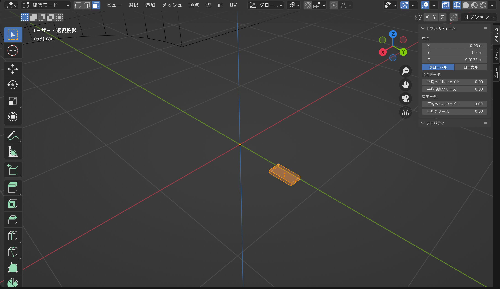
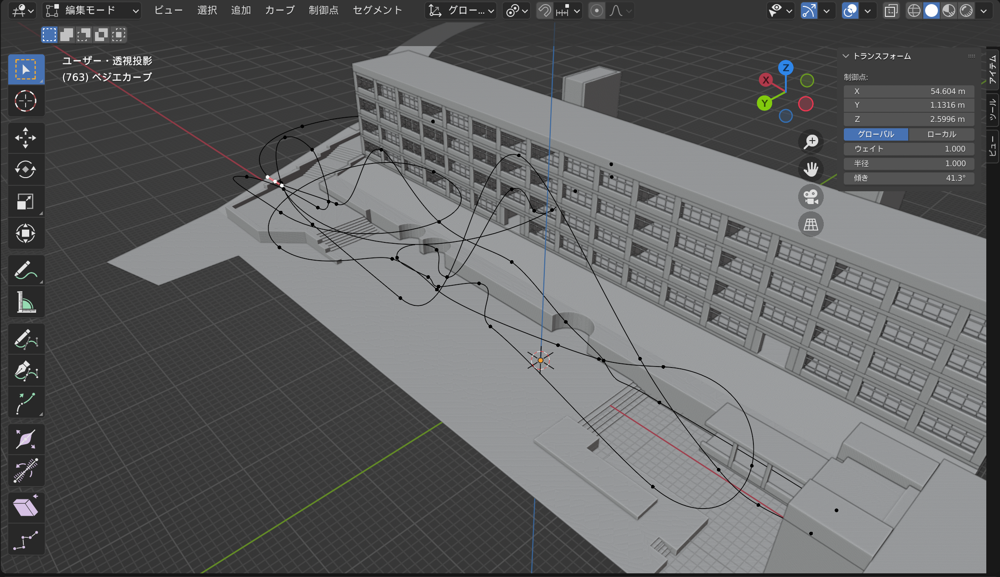
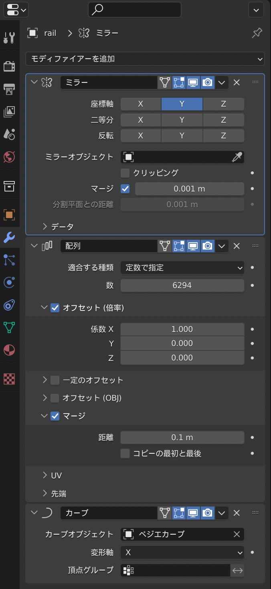
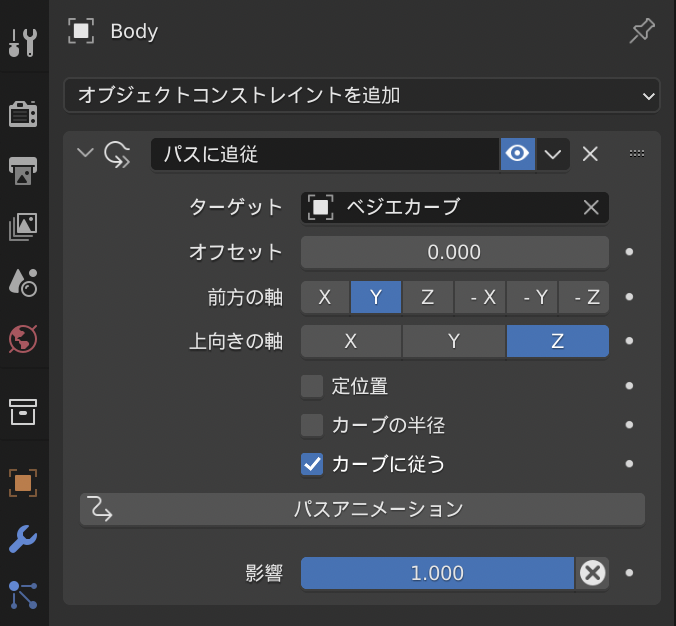

# VRジェットコースターのすべて!

by ZOI

## はじめに

こんにちは、ZOIです。
みなさんは今回の音展で、VRジェットコースターには乗りましたか?
まだ乗っていない人は、ぜひ乗ってみてください。
たった1分少しの作品ですが、非常に多くの技術が使われているので、読む前と後では全く違って見える...かもしれません!

ただ、開発のほぼほぼ全行程を書いているので、長い上に技術的な話しかしていません。
これは本当に申し訳ないです...
それでも良いという方はぜひご覧ください。

なお、部誌の締め切りまでにはそもそもジェットコースターが完成していないので、途中までしか書けません。
これ以降の部誌はきっと音展公式サイト(<https://koyo-onten.net>)のPC部のページに置いてあると思うので、ぜひそちらもご覧ください!

## 開発開始

VRジェットコースターということで、まずはVRの話をします。
VRといっても大きく分けて2種類あります。
専用のホルダーにスマホをはめて使うものと、VRゴーグルを使うものです。
それぞれ基本的には「3DoF」「6DoF」と呼ばれるトラッキングを採用していて、6DoFは3DoFに加えて縦横への移動にも反応してくれます。

<table>
    <tr>
        <td></td>
        <td></td>
    </tr>
</table>

ジェットコースターではレールの下を覗きこむなどの動作もしたいので、今回は6DoFを使うことにしました。
実際に触ってみると分かりますが、3DoFと6DoFでは没入感が全く違います。
専用のVRゴーグルというのはいろいろな種類があるのですが、「追加で高性能なPCが要らない」「そこまで高くない」という条件から、Meta Quest 2を使うことにしました。
これはVRの入門機のような扱いをされているもので、一番売れているゴーグルです。
なによりコスパがいいです。
あと、中身がAndroidベースなのでアプリを作りやすいです。
このあたりは後で詳しく話します。

## 3Dモデル作成

ジェットコースターを作るので、走らせるコースを作る必要があります。
去年、PC同好会で「甲陽ストリートビュー」という作品を作ったのですが、そのプロジェクトの一環として校舎のモデルを作ったことがあります。
せっかくなのでこれをベースにしましょう。
3Dモデルの作成はBlenderで行います。
無料なのにプロ向けの機能が使えるすごいやつです。
VRChatなどのアバター制作によく使われていますね。

校舎のモデルがあるので、あと作らなければいけないのはレールと車体です。
車体は立方体を窪ませてなんとかするとして、レールは平行な棒を2本用意する必要があります。
これを手作業でやろうとすると大変なので、Blenderのモディファイアやカーブ、コンストレイントなどを駆使して楽をします。
今回、レールはレーザーのようなイメージにしたいので、薄い長方形のような断面にします。
実は、レールのために作らなければいけないモデルはこれだけです。

原点と少しずれた場所にあるのがポイントです。
次に、レールを配置したい形にカーブを引きます。

最後に、レールのオブジェクトに対してミラー、配列、カーブのモディファイアを設定します。

ミラーでレールを左右に配置、配列で直線状に伸ばして、カーブでカーブにそって曲げるといったかんじです。
レールが変に捻じれると思うので、カーブの各頂点の「傾き」プロパティをいじって調整してください。

## レール上を滑らせる

最終的にVRゴーグルに入れる際にはUnityというアプリ(後述)を使うので、Unity内蔵の物理エンジンを使えば良いと思っていたのですが、実際にやってみるとガタガタしてうまく使えませんでした。
そこで、Blender上でアニメーションを作り、Unityにインポートするという方法をとることにしました。
Blenderにはさっき作ったレールのカーブがあるので、これに沿って車体を移動させることで、滑らかに滑らせることができます。
車体のモデルに対してパスに追従のコンストレイントを設定することで、カーブに沿って動くようになります。

ただし、物理演算に基づいた動きをするわけではないので、手動でそれっぽく見せる必要があります。

## アプリ化

さっき説明を省略したUnityについて話します。
Unityとは、「ゲーム開発環境」と呼ばれるアプリの一つです。
その名の通りゲームが作れるアプリで、有名どころでは「ポケモンGO」「原神」「ウマ娘」などはこれを使って作られています。
原神などをやったことある人ならわかると思うんですが、あれってPCとスマホで同じゲームが動いてますよね。
あれって実はすごいことで、本当ならWindows用、mac用、iPhone用、Android用...とほぼ1から書き直さないといけないところを、1つ書くだけで全部作れてしまうという化け物です。
まあ今回はQuest2、つまりはAndroid用のアプリしか作らないですけど。

では、作ったモデルをUnityにインポートです。
といっても最近のUnityは.blendファイルの読み込みに対応しているようなので、Unity上でファイルを選択し、プロパティのRigのアニメーションタイプをジェネリックに、Animationのインポートをいい感じにチェックつけたらアニメーションがインポートされます。

シーンにPrefabとして配置したら、Animatorコンポーネントを追加、そして適当にアニメーションコントローラを作って当ててください。
中に入れるアニメーション自体は.blendファイルの中に含まれている感じになっていると思うので、頑張って探しましょう。僕の場合一番最後にありました。

最後に、Unityのカメラを追従させましょう。
これは簡単で、シーン中のカートのモデルをなんとかして見つけ出し、それの子としてカメラを作るだけです。

できたら再生してみましょう。
ジェットコースターっぽくなりました。

## VR化

さあこのままではタイトル詐欺です。「VR」ジェットコースターと言っているからにはVRで動くようにしましょう。
今回はMeta Quest2のスタンドアローン(PCに繋がない)での動作を想定しているので、Android向けにビルドします。
Android向けのビルド環境ができていない人は、Unity Hubを開いて、使っているUnityにAndroid系のモジュールを加えてください。
そしてQuest2を準備しましょう。

(ちなみにQuest2を買おうとしてた時に突如2万円値上げしてめっちゃ困りました。
他の予算を削ってなんとかなりましたが...)

Quest2を開発者モードにします。
Quest2のセットアップに使ったスマホを使い、Oculusアプリの設定→その他の設定から開発者モードをONにできます。
開発者としてグループを作れみたいなことを言われるかもしれませんが指示に従っておけば大丈夫です。
その後パソコンとケーブルで繋ぐと、Quest2の画面に「許可しますか?」的な質問が表示されるので「はい」を押して許可してください。
これで、Quest2をパソコンから触れるようになりました。

では、Unityのビルド設定をします。
プラットフォームをAndroidに切り替え、プレイヤー設定を開き「企業名」「プロダクト名」「バージョン」を設定です。
ここまでは普通のAndroidアプリと同じですね。
ただ追加で、色空間をリニアに、テクスチャ圧縮をASTCにする必要があります。

ここからVR対応にしていきます。
まずはプロジェクト設定の中のXR Plugin Managementをインストールします。
インストールが終わったらプラグインプロバイダーをOculusにしてください。

この状態で実行してみたところ、Quest2に映りはするけれども顔の角度が考慮されていないような挙動をしたので、VR用にカメラの設定をします。
Asset Storeから「Oculus Integration」をインストールします。
結構時間かかります。
終わったら、Assets/Oculus/VR/PrefabsにあるOVRCameraRigを、今カメラを入れている場所に配置します。
カートの子になりますね。
これで実行するとちゃんとしたVRになります。

## あとがき

残念ながら、締め切りと分量の関係でこの辺りまでしか書けませんでした...
一応これでもVRでジェットコースターではあるので許して欲しいです。
はじめに書いたようにまだ完成していないのでなんともいえないのですが、Web版ではこれに加えて、

- 星空の作成・表示
- 時刻の変更
- 可動部分の回路設計・マイコン関連

などが書けたらいいなと思っています。

完全に技術日記になってしまったような感じはありますが、VRで何か作りたいと思っている人や3Dに興味がある人には多少参考になるものができたのではないかと思います。

数年後になるかもしれないけれど、この記事を何かに役立ててくれる人がいれば非常に嬉しいです。
