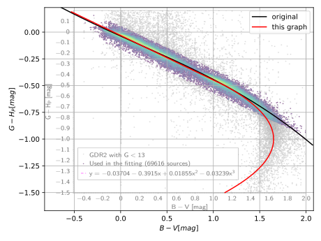

またまたこんにちは、ZOIです。
この章では、VRで見れる、めちゃくちゃリアルな星空を作ってみたので、その話をしていきます。

## 1. 星の再現

さて、星空を作るということで、まず星が必要です。
星空の画像を撮ってきて貼ればいいんですが、それだと面白くないですよね〜。
というわけでせっかくなので、現実の星のデータを使って星を表示してみようと思います!
星のデータをWikipediaかどこかで一つずつ調べていくと死んでしまうので、ESA(ヨーロッパ宇宙機関)がまとめてくれた便利なデータを使います。
今回使うのは`Hipparcos`、`Gaia`という2つの衛星で観測されたものにします。
それぞれHipparcos星表、Gaia星表と呼ぶことにすると、Hipparcos星表は主に明るい星(12等星以上)、Gaia星表は暗い星(20等星以上)の情報を含んでいます。
このデータを使ってどのように星を表示するか考えましょう。
もちろん星を一つ一つ3Dデータとして表示するのでもいいのですが、さっき紹介したHipparcos星表は約12万、Gaia星表は約18億の星のデータがあります。
こんなものを3Dデータとして使ってしまうと、たとえ星を1ポリゴンで表せたとしても、18億ポリゴンになってしまいます。
これをOBJ形式で表した場合、少なめに(1ポリゴン=50バイトで)見積もっても90GiBになります。
現実的じゃないです。
そこで、8Kサイズのテクスチャに星空を書き込んでおいて、それを球に貼り付けて表示することにしましょう。

### a. データの取得

さて、今からテクスチャに書き込んでいくわけですが、画像出力する時にはHipparcos星表、Gaia星表の全てのデータを持っておく必要があります。
というわけでダウンロードです。
どう考えてもGaia星表のダウンロードには時間がかかるので、先に始めましょう。

まず、Gaia星表はいくつかバーションがあるのですが、今回は最新(2022/3/12時点)のEarly Data Release3を使ってみます。
<http://cdn.gea.esac.esa.int/Gaia/gedr3/gaia_source/>からダウンロードできるのですが、`3386`個の圧縮ファイルに分けて公開されています。
これを手作業でダウンロードするのは大変なので、さっさとスクリプトを書いてパソコンに無休労働させましょう。
Webページにリンクが並んでいるので、今回はLinuxのwgetの`-r`オプションを使ってみます。
もちろん、下の方で公開されている`_MD5SUM.txt`あたりからファイル名を抽出(簡単です)すれば他にもいろいろなやり方ができるので、それでも何の問題もありません。
僕が持っているデスクトップはWindowsなので、WSLで実行することにして、こんな感じのスクリプトを書いてみました。

`download.sh`

```bash
#!/bin/sh
cd "/mnt/f/Gaia EDR3/data/"
wget -r --no-parent --continue http://cdn.gea.esac.esa.int/Gaia/gedr3/gaia_source/
read -p "Press [Enter] key to resume."
```

これを`$ ./download.sh`で実行すればダウンロード完了...なのですが、なんせサイズがめちゃくちゃでかいので数日かかります。
パソコンの容量も足りなくなるとおもうので、家に転がっている1, 2TBくらいのHDDを持ってきましょう。

参考になるかわかりませんが、僕の場合は〇〇GBあり、ダウンロードには〇〇時間かかりました。
`wget`でのダウンロードでは早くても700KB/sしか出てなかったので、設定がおかしかったのかもしれません。
少なくとも`aria2`など早いダウンローダーを使うべきですね。
(`-r`に相当するものはなさそうですが)

次はHipparcos星表のダウンロードです。
Hipparcos星表のデータは`FTP`という仕組みを使ってダウンロードするようになっています。
(FTPはHTTPのファイル特化バージョンみたいなものです。)
とりあえずChromeか何かで<ftp://dbc.nao.ac.jp/DBC/NASAADC/catalogs/1/1239/>を開きましょう。
ユーザー名やパスワードを聞かれるとおもうのですが、`匿名でログインする`を選択して進みます。
するとNASAのサーバー上のフォルダを開いたみたいな感じになっているとおもうので、その中にある`hip_main.dat.gz`を好きな場所(Gaiaの近くでいいと思います)にダウンロードしてきます。
サイズは約231MBです。
Gaiaと比べると小さく思えますが、一文字=1byteなので2億3千万文字で十分多いです。
(ちなみに「転生したらスライムだった件」は全部で200万文字程度です。)

...というわけで、星空の再現に必要なデータは全て揃いました!

### b. データの整理

さてデータをダウンロードしたわけですが、この中にはめちゃくちゃいろんなデータが含まれています。
今回は星を描画するだけなので、測定誤差とか明るさの変わりかたとかいう情報は必要ないです。
後で描画するときにデータを読み込むのですが、その時のファイルサイズはできるだけ小さい方が早くなります。
というわけで、データの必要な部分だけを別のファイルにコピーしていきましょう。

全体的な流れとしては以下のような感じですね。

1. Gaiaデータ保存ディレクトリ内の全ての`.gz`ファイルに対して`2.`~`4.`を繰り返す
2. `.gz`ファイルを`byte[]`として読み込み、解凍して`string`に戻す
(解凍には`GZipStream`を利用)
3. `2.`でできたcsv形式のstringを`StarData[]`(自作クラス)に変換する
(必要な情報のみ)
4. `StarData[]`を別のファイルにCSV形式で書き込む
(ただしHipparcosに含まれているデータは除外)
5. Hipparcosに対しても繰り返す

データには本当にいろいろなデータが含まれているのですが、今回は「赤経」「赤緯」「等級」「色指数」というデータだけを使うことにします。

#### 用語解説

赤経 / 赤緯
: 北極星のあたりを天の北極として天球を考えた時の緯度 / 経度。
  天球上での星の位置を表します。

等級
: よく1等星とか2等星とか言ってるやつ。
  1等級上がると $\sqrt[5]{100}\fallingdotseq2.512$倍の明るさになる。
  マイナスや小数のときもあります。

色指数
: 星の色を表す値。
  今回はB-V色指数を基準にすることにしました。
  青の光を通すBバンドフィルタを通った光の強さから、緑〜黄の光を通すVバンドフィルタを通った光の強さを引いたものです。

#### データの変換

色指数について、Gaia星表は独自のフィルタ(<https://www.cosmos.esa.int/web/gaia/edr3-passbands>)で計測しているので、B-V色指数への変換が必要です。
ESAのページ(<https://gea.esac.esa.int/archive/documentation/GDR2/Data_processing/chap_cu5pho/sec_cu5pho_calibr/ssec_cu5pho_PhotTransf.html#Ch5.F11>)にある式が使えそうです。
$G, G_{BP}, G_{RP}$を$B - V$にする関数はないのですが、$G_{BP}-G_{RP}$から$G-H_P$、$G-H_P$から$B-V$にする関数は作れそうです。
ただ、$G-H_P$から$B-V$にする関数のグラフの右下の方があまり信用できないので、逆関数にするついでに、なんとなくで式を作ってみました。
$$
\left\{
  \begin{array}{ll}
    -2.4y-0.075 &(y \geq -0.5) \\
    -2.1y^2-4.2y-0.45 &(y < -0.5)
  \end{array}
\right.
$$

こんな適当な式でちゃんと動くのか?って感じもしますが、グラフ書いてみたらそれっぽかったのでまあ大丈夫でしょう。



(目盛りが2つあるのは、元のグラフを画像として取り込んで、その上にグラフを書いているからです。)

#### いざ変換

処理を書く言語は何でもいいんですが、今回はC#を使います。

というわけで、早速コードです。

```csharp
public class DataExtractor {
  private const OUT_FILE = @"path¥to¥File.csv";
  private const GAIA_PATH = @"path¥to¥Gaia¥";

  public static void Main() {
    using (var outFStream = File.Open(OUT_FILE, FileMode.OpenOrCreate)) {
      string[] gaiaFiles = GetGaiaFiles();
      foreach (string gaiaFile in gaiaFiles) {
        using (var fStream = File.OpenRead(GAIA_PATH + gaiaFile))
        using (var gStream = new GZipStream(fStream, CompressionMode.Decompress))
        using (var reader = new StreamReader(gStream)) {
          bool isFirstLine = true;
          while (reader.EndOfStream == false) {
            // 1行目はタイトルなのでスキップする
            if(isFirstLine) {
              isFirstLine = false;
              continue;
            }
            string line = sr.ReadLine();
            string[] strData = line.Split(',')
            outFStream.WriteLine(StarData.FromGaiaProperty(strData[5], strData[7], strData[69], strData[74], strData[79]).ToString());
          }
        }
      }
    }
  }

  private static string[] GetGaiaFiles() {
    // 今回は、一緒にダウンロードした_MD5SUM.txtからファイル名を抜き出して使います
    StreamReader sr = new StreamReader(GAIA_PATH + "_MD5SUM.txt");
    string md5sumContent = sr.ReadToEnd();
    sr.Close();
    return md5sumContent.Split('¥n').map(s => s.Split(' ')[1]);
  }
}
private class StarData {
  public final float Ra;      // 赤経
  public final float Dec;     // 赤緯
  public final float VMag;    // 等級
  public final float BVColor; // 色指数

  public StarData(float ra, float dec, float vmag, float bvcolor) {
    this.Ra = ra;
    this.Dec = dec;
    this.VMag = vmag;
    this.BVColor = bvcolor;
  }

  public static StarData FromGaiaProperty(float ra, float dec, float phot_g_mean_mag, float phot_bp_mean_mag, float phot_rp_mean_mag) {
    float G_HP = 0.0149 * Math.Pow(phot_bp_mean_mag - phot_rp_mean_mag, 3)
      - 0.12 * Math.Pow(phot_bp_mean_mag - phot_rp_mean_mag, 2)
      - 0.2344 * (phot_bp_mean_mag - phot_rp_mean_mag)
      - 0.01968;
    float bvcolor = -0.5 <= G_HP
      ? bvcolor = - 2.4 * G_HP - 0.075
      : bvcolor = - 2.1 * Math.Pow(G_HP, 2) - 4.2 * G_HP - 0.45;
    return StarData(ra, dec, phot_g_mean_mag, bvcolor);
  }

  public string ToString() {
    return $"{Ra}, {Dec}, {VMag}, {BVColor}";
  }
}
```
