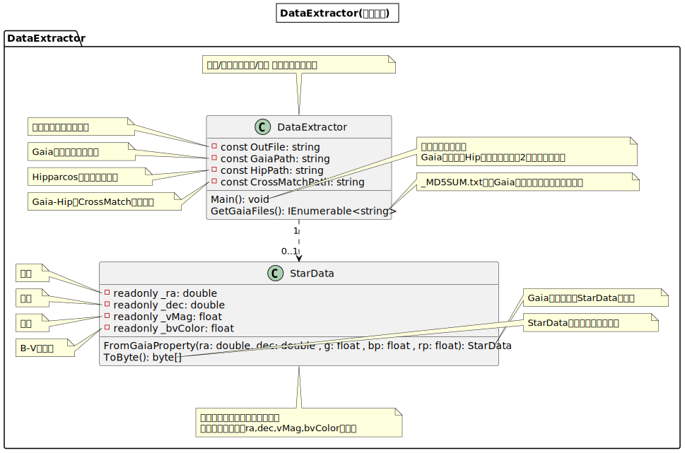
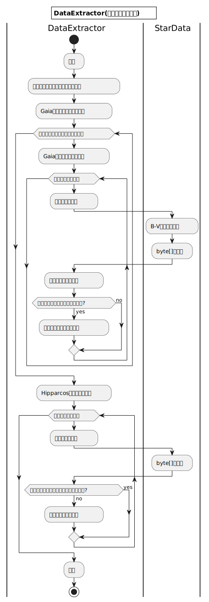

またまたこんにちは、ZOIです。
この章では、VRで見れる、めちゃくちゃリアルな星空を作ってみたので、その話をしていきます。

## 1. 星の再現

さて、星空を作るということで、まず星が必要です。
星空の画像を撮ってきて貼ればいいんですが、それだと面白くないですよね〜。
というわけでせっかくなので、現実の星のデータを使って星を表示してみようと思います!
星のデータをWikipediaかどこかで一つずつ調べていくと死んでしまうので、ESA(ヨーロッパ宇宙機関)がまとめてくれた便利なデータを使います。
今回使うのは`Hipparcos`、`Gaia`という2つの衛星で観測されたものにします。
それぞれHipparcos星表、Gaia星表と呼ぶことにすると、Hipparcos星表は主に明るい星(12等星以上)、Gaia星表は暗い星(20等星以上)の情報を含んでいます。
このデータを使ってどのように星を表示するか考えましょう。
もちろん星を一つ一つ3Dデータとして表示するのでもいいのですが、さっき紹介したHipparcos星表は約12万、Gaia星表は約18億の星のデータがあります。
こんなものを3Dデータとして使ってしまうと、たとえ星を1ポリゴンで表せたとしても、18億ポリゴンになってしまいます。
これをOBJ形式で表した場合、少なめに(1ポリゴン=50バイトで)見積もっても90GiBになります。
現実的じゃないです。
そこで、8Kサイズのテクスチャに星空を書き込んでおいて、それを球に貼り付けて表示することにしましょう。

### a. データの取得

さて、今からテクスチャに書き込んでいくわけですが、画像出力する時にはHipparcos星表、Gaia星表の全てのデータを持っておく必要があります。
というわけでダウンロードです。
どう考えてもGaia星表のダウンロードには時間がかかるので、先に始めましょう。

まず、Gaia星表はいくつかバーションがあるのですが、今回は最新(2022/3/12時点)のEarly Data Release3を使ってみます。
<http://cdn.gea.esac.esa.int/Gaia/gedr3/gaia_source/>からダウンロードできるのですが、**3386個**の圧縮ファイルに分けて公開されています。
これを手作業でダウンロードするのは大変なので、さっさとスクリプトを書いてパソコンに無休労働させましょう。
Webページにリンクが並んでいるので、今回はLinuxのwgetの`-r`オプションを使ってみます。
もちろん、下の方で公開されている`_MD5SUM.txt`あたりからファイル名を抽出(簡単です)すれば他にもいろいろなやり方ができるので、それでも何の問題もありません。
僕が持っているデスクトップはWindowsなので、WSLで実行することにして、こんな感じのスクリプトを書いてみました。

`download.sh`

```bash
#!/bin/sh
cd "/mnt/f/Gaia EDR3/data/"
wget -r --no-parent --continue http://cdn.gea.esac.esa.int/Gaia/gedr3/gaia_source/
read -p "Press [Enter] key to resume."
```

これを`$ ./download.sh`で実行すればダウンロード完了...なのですが、なんせサイズがめちゃくちゃでかいので時間がかかります。
パソコンの容量も足りなくなるとおもうので、家に転がっている1~2TBくらいのHDDを持ってきましょう。
僕の場合はファイルが613GBあり、ダウンロードには300時間弱かかりました。

`wget`でのダウンロードでは早くても700KB/sしか出てなかったので、設定がおかしかったのかもしれません。
少なくとも`aria2`など早いダウンローダーを使うことをお勧めします。

次はHipparcos星表のダウンロードです。
<https://cdsarc.cds.unistra.fr/ftp/I/311/hip2.dat.gz>をダウンロードしたら終わりです。
Gaiaみたいにファイルがいくつもあるわけじゃないし手動で十分でしょう。
サイズは9MBです。解凍したら32.7MBになります。

(Gaiaと比べると小さく思えますが、一文字=1byteなので3千万文字で十分多いです。
ちなみに文庫本1冊で大体10万文字なので、印刷したら本300冊くらいになります。)

最後に、クロスマッチのデータもダウンロードする必要があります。
今回はGaia、Hipparcosの2つの星表を使うので、どちらにも含まれている星があります。
クロスマッチデータとは、どの星とどの星が同じ星なのかを表しているデータです。
これを使うことで、星を2回数えてしまうことなどを避けられます。
<http://cdn.gea.esac.esa.int/Gaia/gedr3/cross_match/hipparcos2_best_neighbour/Hipparcos2BestNeighbour.csv.gz>からダウンロードしましょう。
圧縮1.8MB、解凍後4.2MBで一番小さいファイルですね。

...というわけで、星のデータは全て揃いました!

### b. データの整理

さてデータをダウンロードしたわけですが、この中にはめちゃくちゃいろんなデータが含まれています。
今回は星を描画するだけなので、測定誤差とか明るさの変わりかたとかいう情報は必要ないです。
後で描画するときにデータを読み込むのですが、その時のファイルサイズはできるだけ小さい方が早くなります。
というわけで、データの必要な部分だけを別のファイルにコピーしていきましょう。

全体的な流れとしては以下のような感じですね。

1. Gaiaデータ保存ディレクトリ内の全ての`.gz`ファイルに対して`2.`~`4.`を繰り返す
2. `.gz`ファイルを`byte[]`として読み込み、解凍して`string`に戻す
(解凍には`GZipStream`を利用)
3. `2.`でできたcsv形式のstringを`StarData[]`(自作クラス)に変換する
(必要な情報のみ)
4. `StarData[]`を別のファイルにCSV形式で書き込む
(ただしHipparcosに含まれているデータは除外)
5. Hipparcosに対しても繰り返す

データには本当にいろいろなデータが含まれているのですが、今回は「赤経」「赤緯」「等級」「色指数」というデータだけを使うことにします。

#### 用語解説

赤経 / 赤緯
: 北極星のあたりを天の北極として天球を考えた時の緯度 / 経度。
  天球上での星の位置を表します。

等級
: よく1等星とか2等星とか言ってるやつ。
  1等級上がると $\sqrt[5]{100}\fallingdotseq2.512$倍の明るさになる。
  マイナスや小数のときもあります。

色指数
: 星の色を表す値。
  今回はB-V色指数を基準にすることにしました。
  青の光を通すBバンドフィルタを通った光の強さから、緑〜黄の光を通すVバンドフィルタを通った光の強さを引いたものです。

#### データの変換

色指数について、Gaia星表は独自のフィルタ(<https://www.cosmos.esa.int/web/gaia/edr3-passbands>)で計測しているので、B-V色指数への変換が必要です。
ESAのページ(<https://gea.esac.esa.int/archive/documentation/GDR2/Data_processing/chap_cu5pho/sec_cu5pho_calibr/ssec_cu5pho_PhotTransf.html#Ch5.F11>)にある式が使えそうです。
$G, G_{BP}, G_{RP}$を$B - V$にする関数はないのですが、$G_{BP}-G_{RP}$から$G-H_P$、$G-H_P$から$B-V$にする関数は作れそうです。
ただ、$G-H_P$から$B-V$にする関数のグラフの右下の方があまり信用できないので、逆関数にするついでに、なんとなくで式を作ってみました。
$$
\left\{
  \begin{array}{ll}
    -2.4y-0.075 &(y \geq -0.5) \\
    -2.1y^2-4.2y-0.45 &(y < -0.5)
  \end{array}
\right.
$$

こんな適当な式でちゃんと動くのか?って感じもしますが、グラフ書いてみたらそれっぽかったのでまあ大丈夫でしょう。


(目盛りが2つあるのは、元のグラフを画像として取り込んで、その上にグラフを書いているからです。)

#### いざ変換

処理を書く言語は何でもいいんですが、今回はC#を使います。

コードをここに書くと流石に長すぎるので、ここではUMLだけ載せておきます。
コード本体はGitHub(<https://github.com/ZOI-dayo/VR_Star_DataExtractor>)にあります。

|クラス図|アクティビティ図|
| :----: | :------------: |
|  |  |

見ての通り簡単なコードです。
ファイルが2つに分かれているのですが、合わせても170行しかないです。
ただ処理するデータ量がめっちゃ多いので流石に時間がかかります。
CPUの速度やディスクの速度でだいぶ変わると思いますが、i7-9700K+HDDで5時間半くらいかかりました。
(寝てる間に実行したのでよくわからんけど...)

というわけで、データの取得→整理まで終わりました!
すでに結構な分量の記事になってますが、実は今までの作業は全て準備です。

多分この記事で一番楽しい(個人差あり)ところである「データの画像化」に入っていきましょう!

### c. データの画像化
